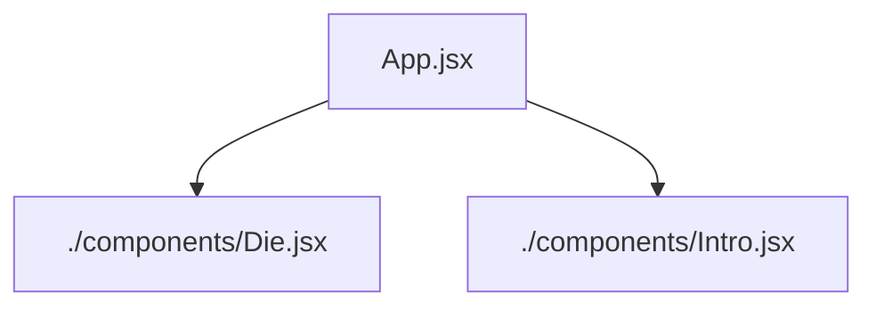

# Travel Journal Card Display

A responsive travel journal card display built with React and vanilla CSS. Features interactive location cards with a draggable image feature for better viewing on smaller screens.

## 🚀 Features

- Fully responsive layout for all screen sizes
- Component-based architecture
- Reusable custom React hook (useRefs, useEffect)
- Clean vanilla CSS styling

## 🔗 Live Demo

 - Live vercel demo: [View Live Project]()

## 🛠️ Tech Stacks

- React.js
- Vanilla CSS
- JavaScript ES6+

## 🎯 Key Learnings

### React Fundamentals
- JSX syntax and component structure
- Props for passing data between components
- State management with `useState`
- React Hooks Basics (useEffect, useRefs)
- Event handling (mouse and touch events)

### CSS Skills
- Flexbox for flexible layouts
- CSS Grid for responsive structures
- Responsive design with media queries
- Mobile-first approach

## 📁 React-tree Structure

## 👤 Author

**[Abinash Dash]**

- GitHub: [@AbiDev2003](https://github.com/AbiDev2003)
---

⭐ Connect with me. Let's grow together !