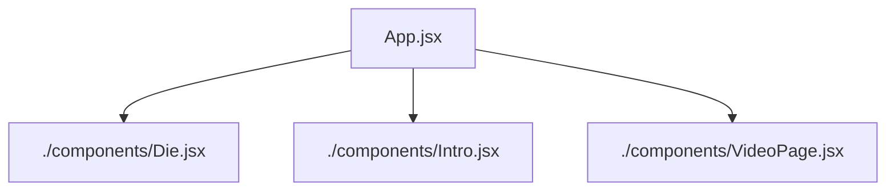

# ReactJS Tenzies Game

### Instructions
- Click on same dices to lock them. Then rolls again, then click on same dices. After all are locked game will be over.Click on newgame button to start a new game
- For example: Select a number 3. You have to lock 3 in the beginning and everytime after a roll. When all three are locked(turn to red) then game is over. 

## 🚀 Features

- Fully responsive layout for all screen sizes
- Component-based architecture
- Clean vanilla CSS styling
- Reusable custom React hook (useRefs, useEffect)
- Used React router for video playing in another jsx component
- Used navigate, when button is clicked navigate to another jsx component. 

## 🔗 Live Demo

 - Live vercel demo: [View Live Project]("https://react-project-tenzies-game.vercel.app/")

## 🛠️ Tech Stacks

- React.js
- Vanilla CSS
- JavaScript ES6+

## Problem Faced
 - Wanted to display my video in README.md file, but github don't support. 
 - Learned and implemented react router to deploy the video in the website directly for user manual. 

## 🎯 Key Learnings

### React Fundamentals
- JSX syntax and component structure
- Props for passing data between components
- State management with `useState`
- Event handling (mouse and touch events)
- React Hooks Basics (useEffect, useRefs)
- React router from 'react-router-dom' package
- useNavigate() from 'react-router-dom'

### CSS Skills
- Flexbox for flexible layouts
- CSS Grid for responsive structures
- Responsive design with media queries
- Mobile-first approach

## 📁 React-tree Structure

## 👤 Author

**[Abinash Dash]**

- GitHub: [@AbiDev2003](https://github.com/AbiDev2003)
---

⭐ Connect with me. Let's grow together !